# Oefeningen hoofdstuk 1: HTML

Download of clone deze repository. Hiervoor klik je op de groene knop.

Pak deze zip uit in de map waar je alle leermateriaal van Webapplicaties I plaatst.

Ga nu naar Visual Studio Code en open deze map.

## OEFENING 1: het betere drilwerk.
De eerste oefening bevat 15 kleine oefeningen om de basistags te leren gebruiken.

Maak eerst een map in de root aan: **driloefeningen**. 
Voor elke oefening (D01- D02) maak je een nieuwe html bestand aan met als naam oefeningxx.html, waarbij de xx vervangen wordt door het nummer van de oefening. Zo maak je voor oefening 1 een html bestand aan met de naam *oefening01.html*.

Om de structuur van een html pagina snel aan te maken in de editor, gebruik je emmet (!tab).

Geef als titel voor je pagina (wordt weergegeven in tabblad van browser) *Oefeningxx*.

De oefeningen zijn hele korte oefeningen om de basistags en de structuur van een webpagina in te oefenen.
De bedoeling is de correcte html te schrijven om onderstaande screenshots in je browser weer te geven.

- Dril 01

    

- Dril 02

    

- Dril 03

    

- Dril 04

    

- Dril 05

    

- Dril 06

    

- Dril 07

    

- Dril 08

    

- Dril 09

    

- Dril 10

    

- Dril 11

    Bij deze oefening maak je het bestand index.html aan. Als je index.html in de browser bekijkt krijg je het volgende:

    

- Dril 12

    Maak twee submappen in de map driloefeningen: de mappen even en oneven. Verplaats de even oefeningen naar even enz. en pas daarna index.html aan. Het resultaat:

    

- Dril 13

    Maak onderstaande, bewaar in de juiste map en pas ook index.html.
    
    

- Dril 14

    Zoek een afbeelding van een tsjechoslowaakse wolfhond, saarlooswolfshond & een wolf.
    Bewaar deze afbeeldingen in een aparte folder (bvb images).
    Maak onderstaande:

    

- Dril 15

    Maak onderstaande. Samenvattende oefening met bijna alle elementen uit HTML basis en wat online zoekwerk.
    Hou tijdens de opbouw de verandering in het oog via de LiveServer en let op de naam van het tabblad.

    

## Oefening 2: Schilderwerken Vander Beken

Deze oefening is een eerste webapplicatie met meerdere pagina's.

Maak deze oefening in de map VanderBeken (is reeds aangemaakt). Deze map bevat reeds alle afbeeldingen die in de oefening worden gebruikt.

**Maak je webapplicatie structuur aan.**

1. Maak de nodige mappen aan:
    - images: voor de afbeeldingen
    - images/thumbnails: voor de thumbnail afbeeldingen
    - realisaties voor de pagina's waar de realisaties als afbeelding wordt weergegeven.
    Verplaats de afbeeldingen naar de juiste mappen.
2. Maak in de root van je applicatie 5 nieuwe bestanden aan, maak gebruik van emmet (**!*tab***):
    - index.html
    - over_ons.html
    - realisaties.html
    - partners.html
    - contact.html 
3. Maak in de realisaties map 5 nieuwe bestanden aan:
    - schilderwerken_appartement.html
    - schilderwerken_muurtechniek.html
    - schilderwerken_toonzaal.html
    - schilderwerken_winkel.html

Nu zou je volgende structuur moeten hebben:

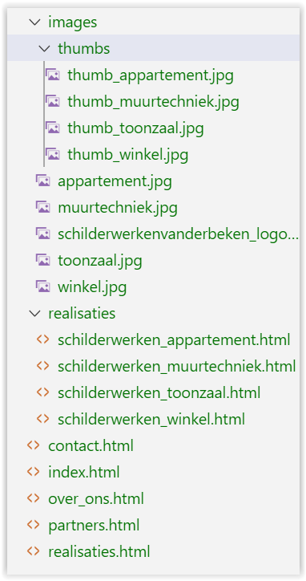

Opmerking: alle titles van de pagina's (tabblad browsers) zijn *Schilderwerken Vander Beken*

### **index.html**
Begin met een logische opbouw: header - nav – main – footer – article –aside – section - …

De content (tekst) vind je in het bestand TekstVanderBeken.txt

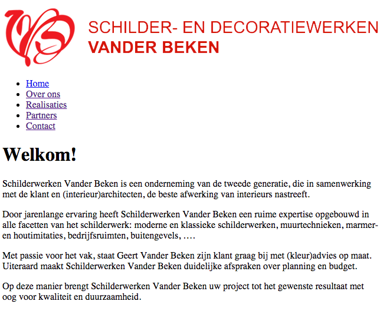

### **over_ons.html**

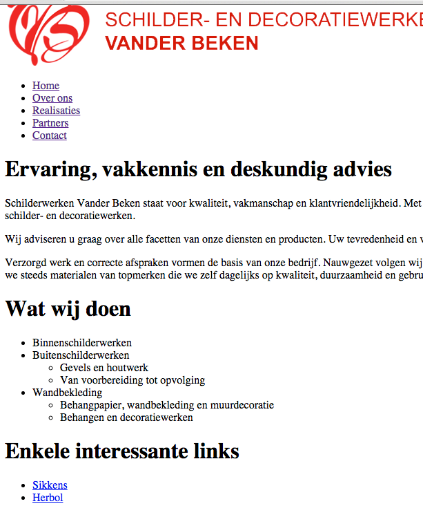

### **realisaties.html**

- De gebruikte afbeeldingen zijn thumb_appartement.jpg, thumb_muurtechniek.jpg, …
- Als je op thumb_appartement.jpg klikt, kom je op de pagina schilderwerken_appartement.html terecht. Analoog bij de andere drie afbeeldingen.
- Voeg in de schilderwerken_....html pagina’s de correcte verwijzing naar de volledige afbeelding toe.

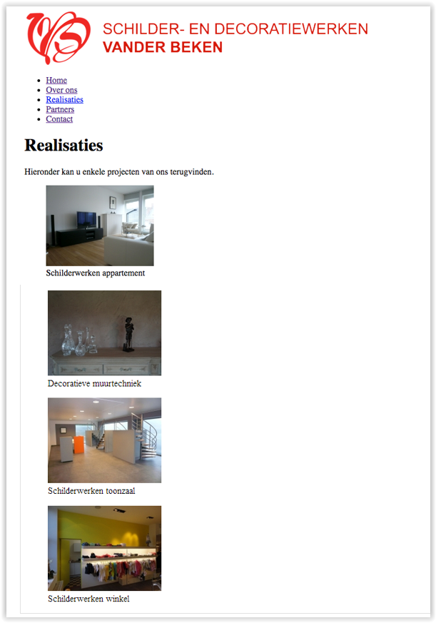

Voorbeeld van **schilderwerken_appartement.html**

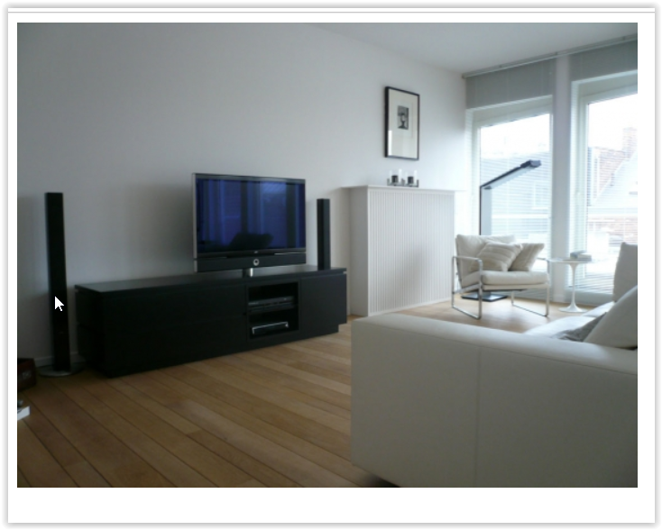

### **partners.html**

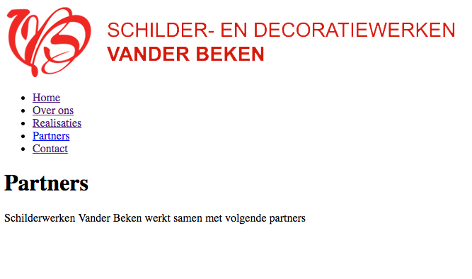

### **contact.html**

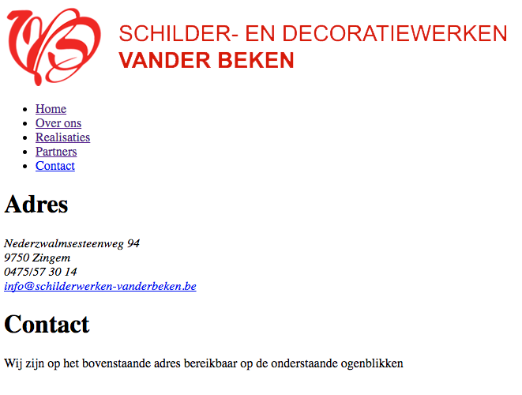

## Oefening 3: Yoko's kitchen
We ontwikkelen volgende mobiele webpagina, week na week werken we verder aan dezelfde oefening. 
Ons uiteindelijk resultaat is een webpagina die optimaal aangepast is voor zowel desktop, tablet als smartphone:

**Desktop**
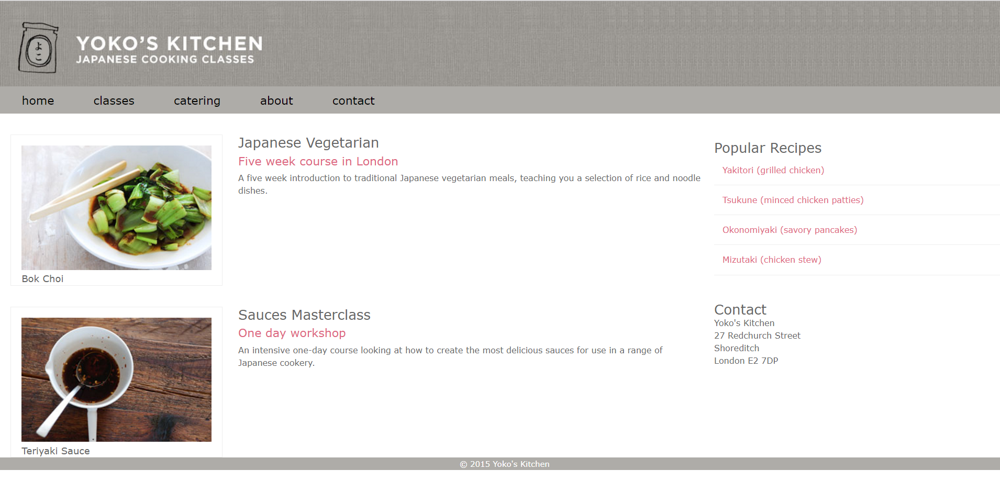

**Tablet**
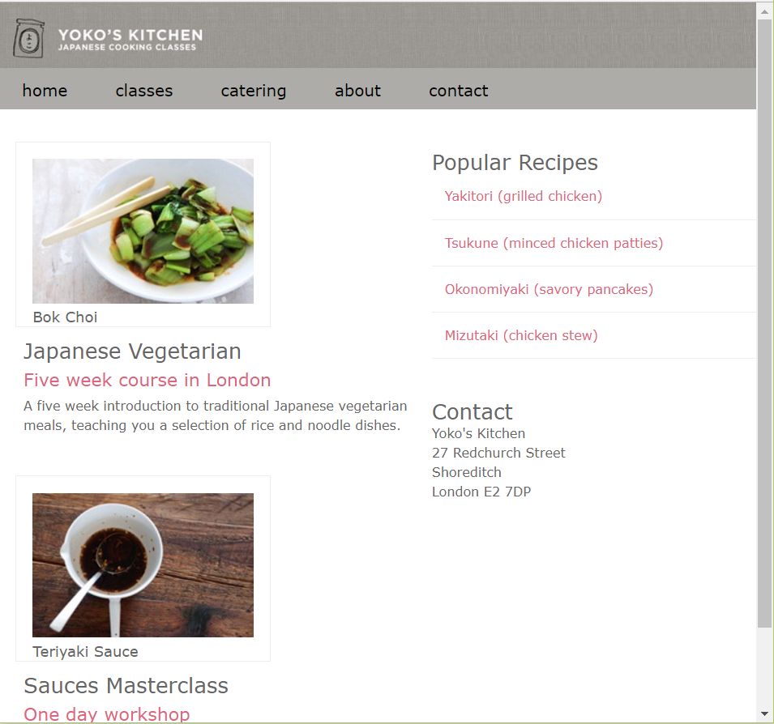

**Smartphone**
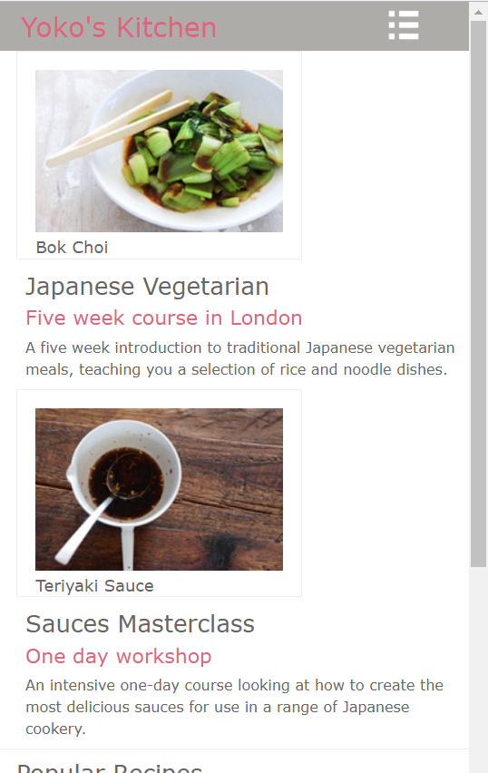

## Deel 1: aanmaken html

Open de map Yoko.

In het eerste deel van de oefening maken we het html deel.
1.	We maken een nieuwe html pagina met als naam index.html
2.	Vul de titel van de pagina aan: Yoko’s kitchen 
3.	Vul de html pagina aan, rekening houdende met de html boom structuur: 

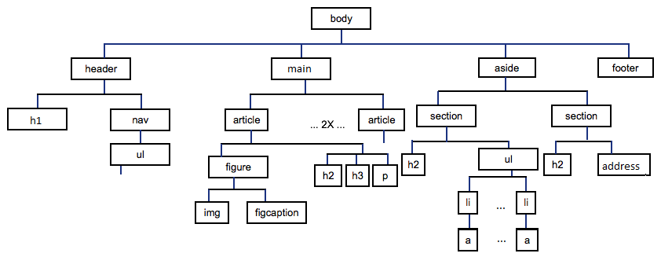

Het resultaat in de browser:

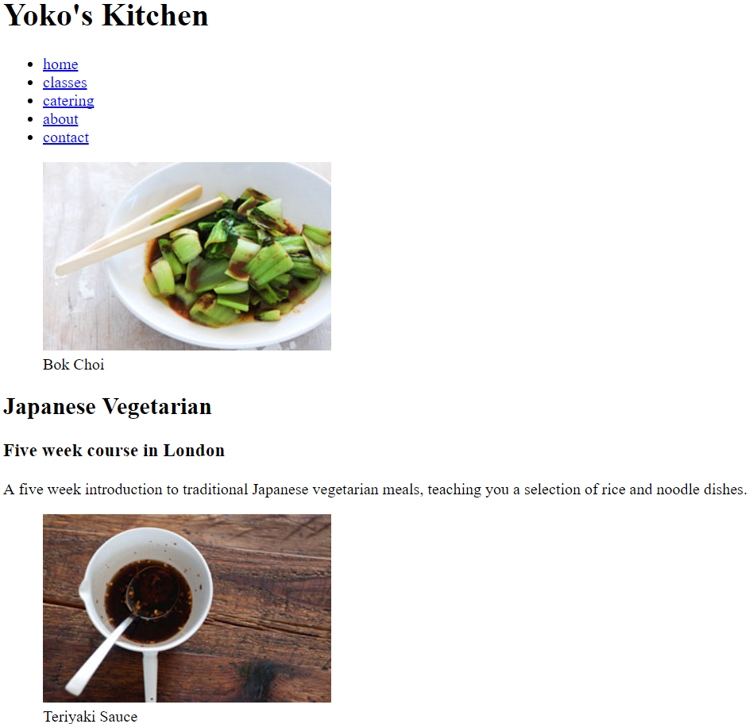
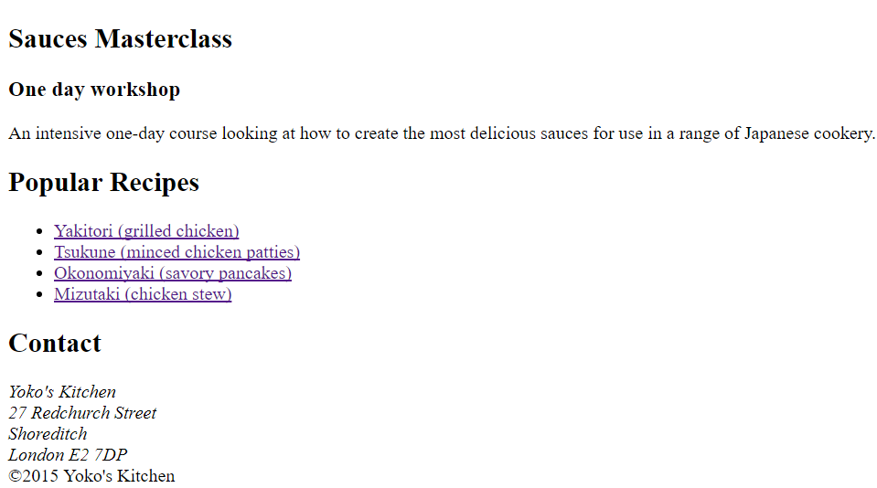