# Oefeningen hoofdstuk 1: HTML

Maak een map aan waar je alle oefeningen van webapplicaties I kan in op slaan.

In deze map maak je een map 01exHTML aan.

Ga naar Visual Studio Code en open deze map.

Voor elke oefening maak je een nieuwe html bestand aan met als naam oefeningxx.html, waarbij de xx vervangen wordt door het nummer van de oefening. Zo maak je voor oefening 1 een html bestand aan met de naam *oefening01.html*.

Om de structuur van een html pagina snel aan te maken in de editor, gebruik je emmet (!tab).

Geef als titel voor je pagina (wordt weergegeven in tabblad van browser) *Oefeningxx*.

De oefeningen zijn hele korte oefeningen om de basistags en de structuur van een webpagina in te oefenen.
De bedoeling is de correcte html te schrijven om onderstaande screenshots in je browser weer te geven.

## Oefening01
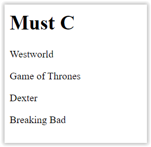

## Oefening02
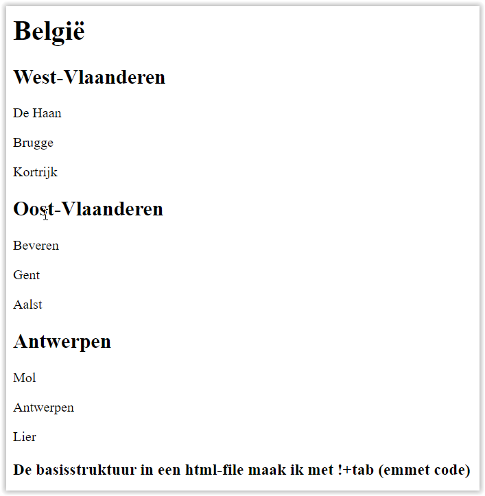

## Oefening03
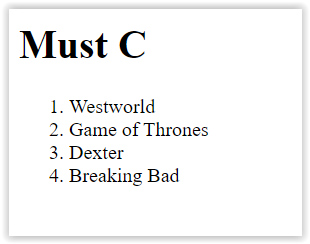

## Oefening04
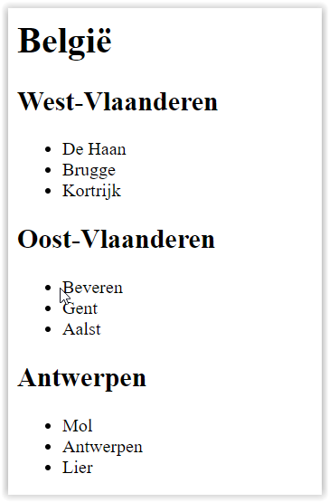

## Oefening05
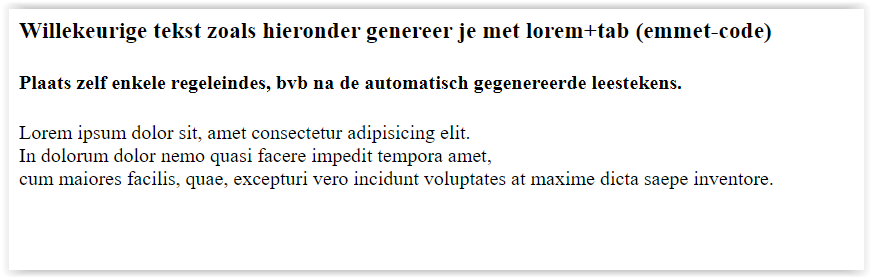

## Oefening06
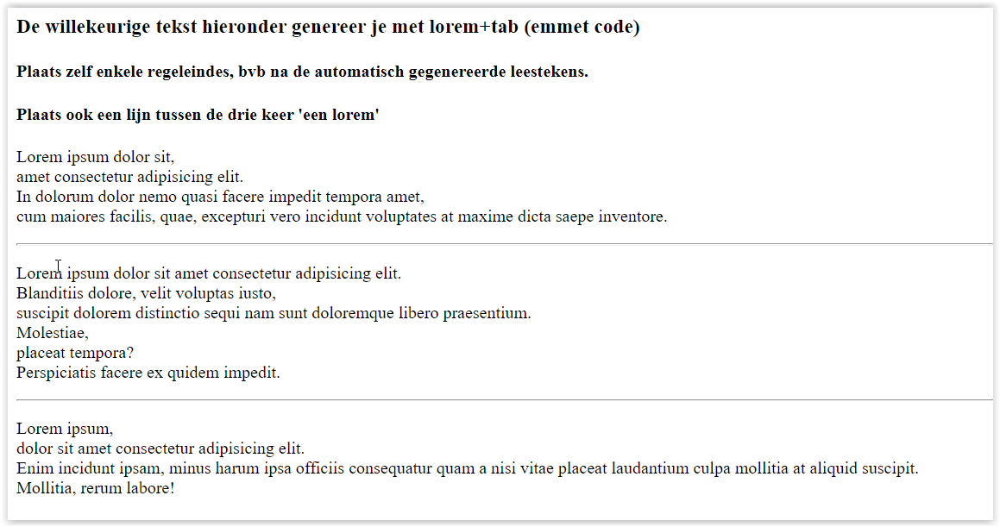

## Oefening07
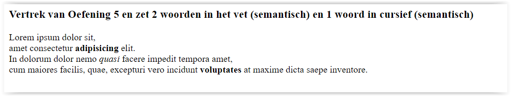

## Oefening08
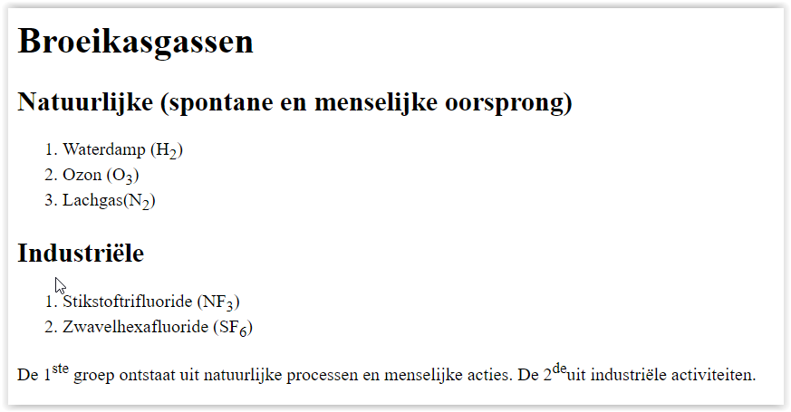

## Oefening09
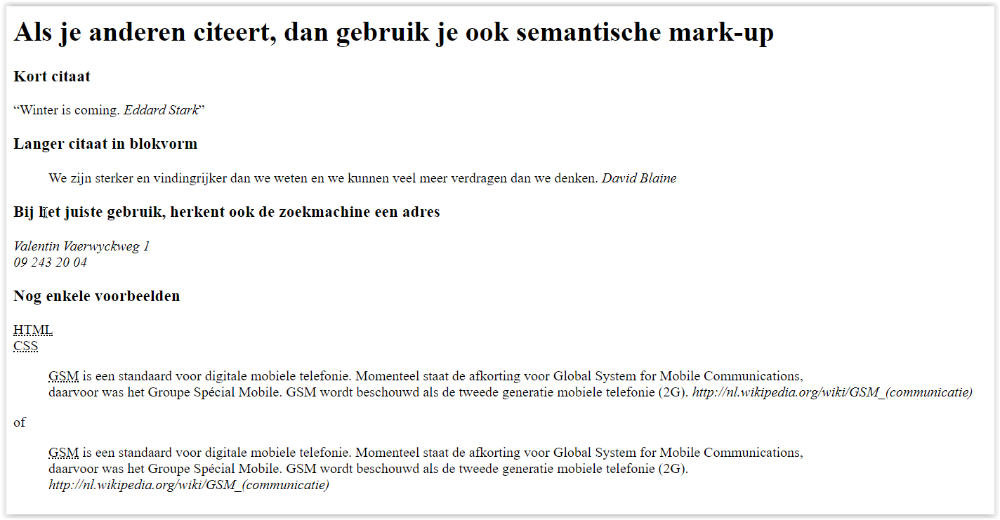

## Oefening10
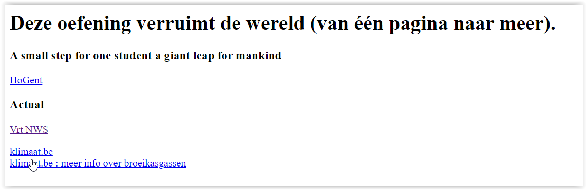

## Oefening11
Bij deze oefening maak je het bestand index.html aan. Als je index.html in de browser bekijkt krijg je het volgende:
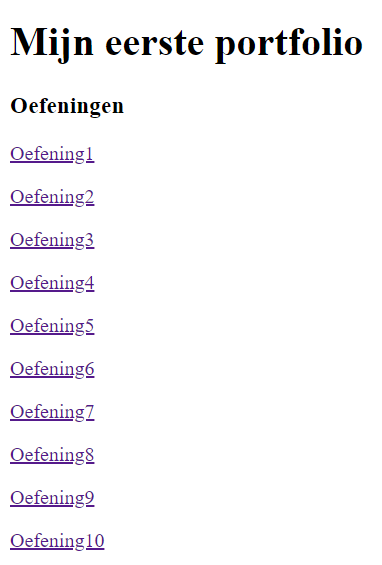

## Oefening12
Maak twee submappen in je projectfolder (de mappen even en oneven). Verplaats de even oefeningen naar even enz. en pas daarna index.html aan. Het resultaat:

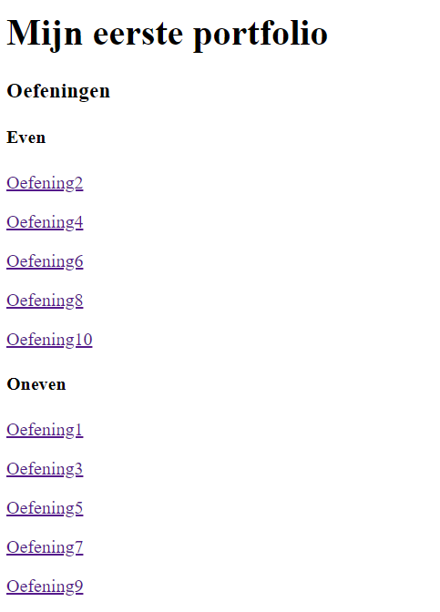

## Oefening13
Maak onderstaande, bewaar in de juiste map en pas ook index.html.
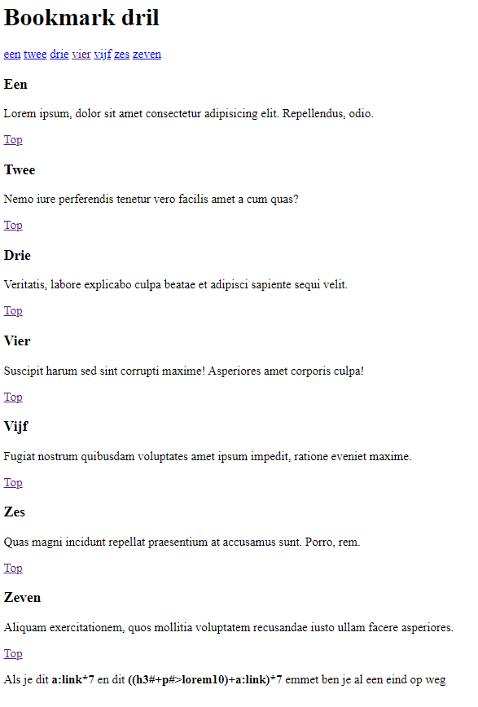

## Oefening14
Zoek een afbeelding van een tsjechoslowaakse wolfhond, saarlooswolfshond & een wolf.
Bewaar deze afbeeldingen in een aparte folder (bvb images).
Maak onderstaande:

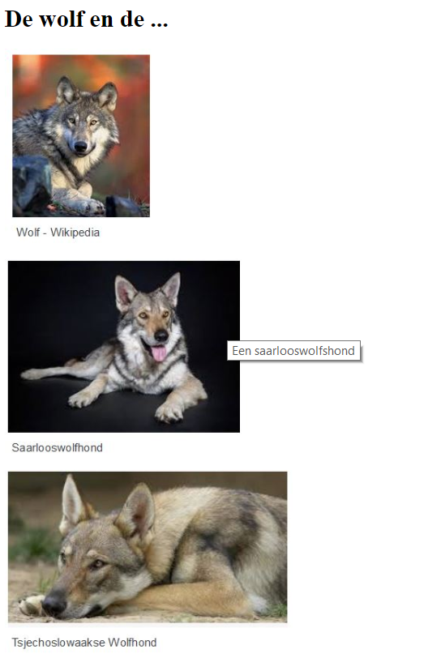

## Oefening15
Maak onderstaande. Samenvattende oefening met bijna alle elementen uit HTML basis en wat online zoekwerk.
Hou tijdens de opbouw de verandering in het oog via de LiveServer en let op de naam van het tabblad.

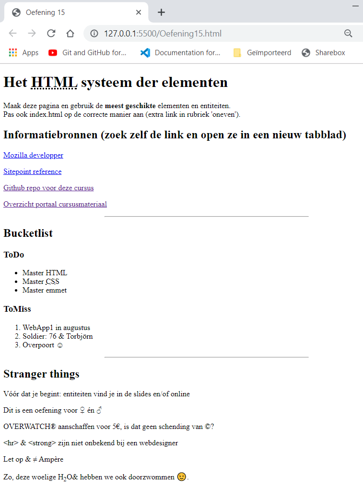
